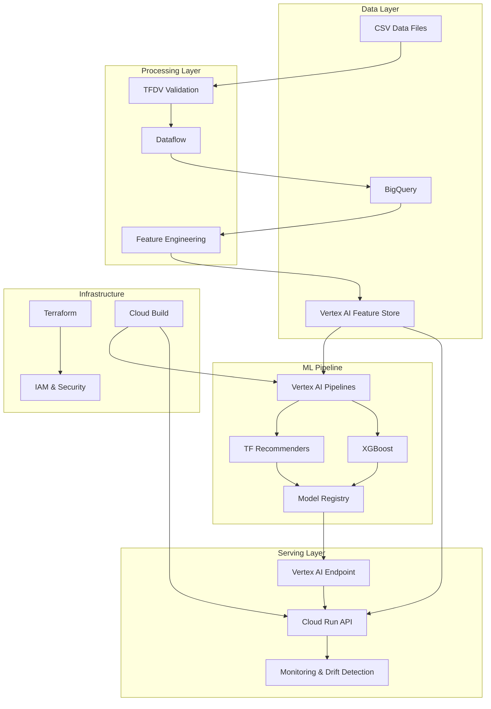

# VertexRec: End-to-End Recommendation System on Google Cloud

Am end-to-end recommendation system built on Google Cloud Platform using Vertex AI, Dataflow, BigQuery, and Cloud Run.

## Architecture



## Features

### Core ML Capabilities

- **Hybrid Recommendation System**: Combines collaborative filtering (TF Recommenders) with content-based ranking (XGBoost)
- **Feature Store Integration**: Online/offline feature parity with Vertex AI Feature Store
- **Model Registry**: Versioned model management with automatic deployment
- **A/B Testing**: Traffic splitting for model comparison

### Production Features

- **Data Validation**: TFDV-based schema validation and anomaly detection
- **Drift Detection**: Automatic model performance monitoring
- **CI/CD Pipeline**: Automated training and deployment
- **Infrastructure as Code**: Complete Terraform deployment
- **Monitoring**: Comprehensive observability with custom metrics

### Evaluation Metrics

- **Recall@K**: User recommendation coverage
- **NDCG@K**: Ranking quality assessment
- **MRR**: Mean reciprocal rank
- **Coverage**: Item recommendation diversity
- **Diversity**: Intra-list diversity metrics

## Tech Stack

### Core Technologies

- **Python 3.11+**: Primary development language
- **TensorFlow Recommenders**: Collaborative filtering models
- **XGBoost**: Gradient boosting for ranking
- **Apache Beam**: Data processing pipeline
- **FastAPI**: High-performance API framework

### Google Cloud Services

- **Vertex AI**: ML platform and model serving
- **BigQuery**: Data warehouse and analytics
- **Cloud Run**: Serverless container platform
- **Dataflow**: Managed data processing
- **Feature Store**: ML feature management
- **Cloud Build**: CI/CD automation

### Infrastructure & DevOps

- **Terraform**: Infrastructure as Code
- **Docker**: Containerization
- **Kubernetes**: Container orchestration
- **Prometheus**: Metrics collection
- **Grafana**: Monitoring dashboards

## Example Use Cases

### Book Recommendation System

```python
# Get personalized book recommendations
response = requests.post(
    "https://vertexrec-api.run.app/recommend",
    json={
        "user_id": "user_12345",
        "k": 10,
        "context": {
            "time_of_day": "evening",
            "device": "mobile"
        }
    }
)
```

### Movie Recommendation API

```python
# Get similar movies
response = requests.post(
    "https://vertexrec-api.run.app/similar",
    json={
        "item_id": "movie_67890",
        "k": 5
    }
)
```
