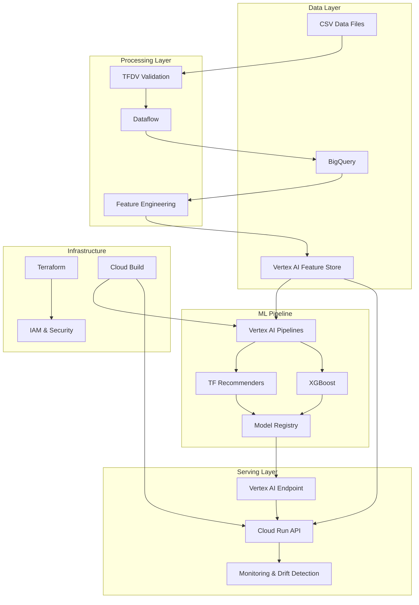

# VertexRec Architecture Guide

## Overview

VertexRec is a production-ready, end-to-end recommendation system built on Google Cloud Platform. This document provides a comprehensive overview of the system architecture, components, and design decisions.

## System Architecture

### High-Level Architecture

## Component Details

### 1. Data Layer

#### Data Sources

- **Synthetic Data**: Generated user-item interaction data for testing and demonstration
- **User Data**: User profiles, demographics, and preferences
- **Item Data**: Item metadata, genres, ratings, and features
- **Interaction Data**: User-item interactions with ratings, timestamps, and context

#### Data Storage

- **BigQuery**: Data warehouse for structured data storage and analytics
- **Cloud Storage**: Raw data files and model artifacts
- **Vertex AI Feature Store**: Online/offline feature storage for ML models

### 2. Processing Layer

#### Data Validation (TFDV)

- **Schema Validation**: Ensures data conforms to expected schemas
- **Anomaly Detection**: Identifies outliers and data quality issues
- **Drift Detection**: Monitors data distribution changes over time

#### Feature Engineering

- **User Features**: Demographics, activity patterns, preferences
- **Item Features**: Metadata, popularity, quality scores
- **Interaction Features**: Temporal patterns, session data, device information
- **Derived Features**: User-item affinity, genre preferences, popularity metrics

### 3. ML Pipeline

#### Model Training

- **TF Recommenders**: Collaborative filtering for user-item recommendations
- **XGBoost**: Ranking model for personalized item scoring
- **Hybrid Approach**: Combines collaborative filtering with content-based features

#### Model Evaluation

- **Ranking Metrics**: Recall@K, NDCG@K, MRR
- **Coverage Metrics**: Catalog coverage, diversity
- **Business Metrics**: Click-through rates, conversion rates

#### Model Registry

- **Version Control**: Track model versions and metadata
- **Model Comparison**: Compare model performance across versions
- **Deployment Management**: Automated model deployment and rollback

### 4. Serving Layer

#### API Service (Cloud Run)

- **FastAPI Framework**: High-performance async API
- **Real-time Recommendations**: Sub-100ms response times
- **Feature Integration**: Real-time feature retrieval from Feature Store
- **Caching**: Redis caching for improved performance

#### Model Serving

- **Vertex AI Endpoints**: Scalable model serving infrastructure
- **A/B Testing**: Traffic splitting for model comparison
- **Auto-scaling**: Automatic scaling based on traffic

### 5. Infrastructure

#### Infrastructure as Code (Terraform)

- **Resource Management**: Automated provisioning of GCP resources
- **Environment Management**: Separate environments for dev/staging/prod
- **Security**: IAM roles, VPC configuration, encryption

#### CI/CD Pipeline

- **Cloud Build**: Automated build, test, and deployment
- **GitHub Actions**: Alternative CI/CD pipeline
- **Quality Gates**: Automated testing and security scanning

## Data Flow

### Training Pipeline

1. **Data Ingestion**: Raw data uploaded to Cloud Storage
2. **Validation**: TFDV validates data quality and schema
3. **Feature Engineering**: Transform raw data into ML features
4. **Model Training**: Train TF Recommenders and XGBoost models
5. **Evaluation**: Comprehensive model evaluation
6. **Registration**: Register models in Vertex AI Model Registry
7. **Deployment**: Deploy models to Vertex AI Endpoints

### Serving Pipeline

1. **Request**: User requests recommendations via API
2. **Feature Retrieval**: Get user and item features from Feature Store
3. **Model Inference**: Generate recommendations using deployed models
4. **Response**: Return personalized recommendations
5. **Logging**: Log requests and responses for analytics

## Technology Stack

### Core Technologies

- **Python 3.11+**: Primary development language
- **TensorFlow 2.15**: Deep learning framework
- **TensorFlow Recommenders**: Recommendation system library
- **XGBoost**: Gradient boosting for ranking
- **Apache Beam**: Data processing pipeline
- **FastAPI**: High-performance API framework

### Google Cloud Services

- **Vertex AI**: ML platform and model serving
- **BigQuery**: Data warehouse and analytics
- **Cloud Run**: Serverless container platform
- **Dataflow**: Managed data processing
- **Feature Store**: ML feature management
- **Cloud Build**: CI/CD automation
- **Cloud Storage**: Object storage
- **Cloud Logging**: Centralized logging
- **Cloud Monitoring**: Observability and alerting

### Infrastructure & DevOps

- **Terraform**: Infrastructure as Code
- **Docker**: Containerization
- **Kubernetes**: Container orchestration (via Cloud Run)
- **Prometheus**: Metrics collection
- **Grafana**: Monitoring dashboards

## Security & Compliance

### Data Security

- **Encryption**: Data encrypted at rest and in transit
- **Access Control**: Role-based access control (RBAC)
- **Audit Logging**: Comprehensive activity tracking
- **Data Privacy**: GDPR compliance features

### Infrastructure Security

- **VPC**: Network isolation and security
- **IAM**: Fine-grained access control
- **Security Scanning**: Automated vulnerability scanning
- **Secrets Management**: Secure handling of API keys and credentials

## Monitoring & Observability

### Metrics

- **System Metrics**: CPU, memory, network, disk usage
- **Application Metrics**: Request rates, response times, error rates
- **Business Metrics**: Recommendation click-through rates, user engagement
- **ML Metrics**: Model performance, prediction accuracy, drift detection

### Logging

- **Structured Logging**: JSON-formatted logs for easy parsing
- **Centralized Logging**: Cloud Logging for log aggregation
- **Log Analysis**: BigQuery for log analytics and insights

### Alerting

- **Performance Alerts**: High latency, error rate spikes
- **Business Alerts**: Recommendation quality degradation
- **Infrastructure Alerts**: Resource utilization, service health

## Scalability & Performance

### Horizontal Scaling

- **Auto-scaling**: Automatic scaling based on traffic
- **Load Balancing**: Distributed traffic across instances
- **Caching**: Multi-layer caching for improved performance

### Performance Optimization

- **Model Optimization**: Quantization, pruning, and optimization
- **Feature Caching**: In-memory feature caching
- **Batch Processing**: Efficient batch inference
- **Async Processing**: Non-blocking API operations

## Disaster Recovery & Backup

### Data Backup

- **Automated Backups**: Regular data backups to Cloud Storage
- **Cross-region Replication**: Data replication across regions
- **Point-in-time Recovery**: Restore data to specific timestamps

### Service Continuity

- **Multi-region Deployment**: Deploy across multiple regions
- **Failover Mechanisms**: Automatic failover to backup regions
- **Health Checks**: Continuous service health monitoring

## Cost Optimization

### Resource Optimization

- **Right-sizing**: Optimize resource allocation
- **Spot Instances**: Use preemptible instances for batch processing
- **Auto-scaling**: Scale down during low usage periods

### Storage Optimization

- **Lifecycle Policies**: Automatic data archival and deletion
- **Compression**: Data compression to reduce storage costs
- **Partitioning**: Efficient data partitioning strategies

## Future Enhancements

### Planned Features

- **Real-time Learning**: Online learning capabilities
- **Multi-modal Recommendations**: Image and text-based recommendations
- **Federated Learning**: Privacy-preserving distributed learning
- **Edge Deployment**: Edge computing for low-latency serving

### Scalability Improvements

- **Microservices Architecture**: Break down monolith into microservices
- **Event-driven Architecture**: Event-driven processing for real-time updates
- **Graph-based Recommendations**: Graph neural networks for complex relationships

## Conclusion

VertexRec provides a comprehensive, production-ready recommendation system that demonstrates best practices in ML engineering, cloud architecture, and DevOps. The system is designed for scalability, reliability, and maintainability, making it suitable for enterprise deployment and as a learning resource for ML engineers.

The architecture emphasizes:

- **Modularity**: Loosely coupled components for easy maintenance
- **Scalability**: Horizontal scaling capabilities
- **Reliability**: Fault tolerance and disaster recovery
- **Observability**: Comprehensive monitoring and logging
- **Security**: Enterprise-grade security and compliance
- **Cost Efficiency**: Optimized resource utilization
