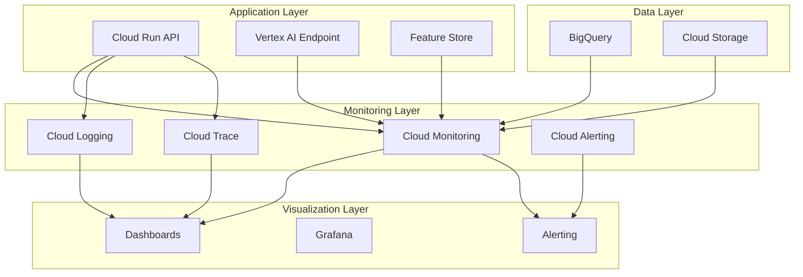

# VertexRec Monitoring Guide

## Overview

This guide provides comprehensive instructions for monitoring the VertexRec recommendation system. It covers system monitoring, application monitoring, business metrics, alerting, and troubleshooting.

## Monitoring Architecture

### Monitoring Stack



## Key Metrics

### System Metrics

#### Infrastructure Metrics

- **CPU Usage**: Average and peak CPU utilization
- **Memory Usage**: Memory consumption and availability
- **Network I/O**: Inbound and outbound network traffic
- **Disk I/O**: Read and write operations
- **Storage**: Disk space usage and availability

#### Cloud Run Metrics

- **Request Count**: Number of HTTP requests
- **Request Duration**: Request processing time
- **Error Rate**: Percentage of failed requests
- **Instance Count**: Number of running instances
- **Concurrency**: Concurrent request handling

#### Vertex AI Metrics

- **Model Latency**: Inference time per request
- **Throughput**: Requests per second
- **Model Errors**: Failed predictions
- **Resource Utilization**: CPU and memory usage
- **Scaling Events**: Auto-scaling activities

### Application Metrics

#### API Performance

- **Response Time**: P50, P95, P99 latencies
- **Throughput**: Requests per second
- **Error Rate**: 4xx and 5xx error rates
- **Availability**: Service uptime percentage
- **Cache Hit Rate**: Feature and response caching

#### Recommendation Quality

- **Recommendation Latency**: Time to generate recommendations
- **Recommendation Count**: Number of recommendations per request
- **Model Accuracy**: Prediction accuracy metrics
- **Feature Freshness**: Age of features used
- **Coverage**: Percentage of items recommended

#### Data Pipeline Metrics

- **Data Processing Time**: Pipeline execution time
- **Data Quality**: Validation success rates
- **Feature Engineering**: Feature computation time
- **Model Training**: Training duration and success
- **Data Freshness**: Age of training data

### Business Metrics

#### User Engagement

- **Active Users**: Daily and monthly active users
- **Recommendation Clicks**: Click-through rates
- **User Retention**: User return rates
- **Session Duration**: Average session length
- **Conversion Rate**: Recommendation to purchase

#### Content Performance

- **Item Popularity**: Most recommended items
- **Genre Distribution**: Recommendation diversity
- **User Preferences**: Preference patterns
- **Seasonal Trends**: Time-based patterns
- **Geographic Patterns**: Location-based insights

## Monitoring Setup

### Cloud Monitoring Configuration

#### 1. Create Monitoring Dashboard

```python
# dashboard_config.json
{
  "displayName": "VertexRec Monitoring Dashboard",
  "mosaicLayout": {
    "tiles": [
      {
        "width": 6,
        "height": 4,
        "widget": {
          "title": "API Request Rate",
          "xyChart": {
            "dataSets": [
              {
                "timeSeriesQuery": {
                  "timeSeriesFilter": {
                    "filter": "resource.type=\"cloud_run_revision\" AND resource.labels.service_name=\"vertexrec-api\"",
                    "aggregation": {
                      "alignmentPeriod": "60s",
                      "perSeriesAligner": "ALIGN_RATE",
                      "crossSeriesReducer": "REDUCE_SUM"
                    }
                  }
                }
              }
            ]
          }
        }
      }
    ]
  }
}
```

#### 2. Set Up Custom Metrics

```python
from google.cloud import monitoring_v3

def create_custom_metric(project_id: str, metric_name: str):
    """Create custom metric for monitoring."""
    client = monitoring_v3.MetricServiceClient()
    project_name = f"projects/{project_id}"

    descriptor = monitoring_v3.MetricDescriptor(
        type=f"custom.googleapis.com/{metric_name}",
        metric_kind=monitoring_v3.MetricDescriptor.MetricKind.GAUGE,
        value_type=monitoring_v3.MetricDescriptor.ValueType.DOUBLE,
        description=f"Custom metric for {metric_name}",
        display_name=metric_name,
    )

    descriptor = client.create_metric_descriptor(
        name=project_name, descriptor=descriptor
    )

    return descriptor
```

#### 3. Configure Alerting Policies

```python
def create_alert_policy(project_id: str, policy_name: str):
    """Create alerting policy for monitoring."""
    client = monitoring_v3.AlertPolicyServiceClient()
    project_name = f"projects/{project_id}"

    policy = monitoring_v3.AlertPolicy(
        display_name=policy_name,
        conditions=[
            monitoring_v3.AlertPolicy.Condition(
                display_name="High Error Rate",
                condition_threshold=monitoring_v3.AlertPolicy.Condition.MetricThreshold(
                    filter='resource.type="cloud_run_revision" AND resource.labels.service_name="vertexrec-api"',
                    comparison=monitoring_v3.AlertPolicy.Condition.MetricThreshold.ComparisonType.COMPARISON_GREATER_THAN,
                    threshold_value=0.05,
                    duration="300s",
                ),
            )
        ],
        notification_channels=[],  # Add notification channels
        alert_strategy=monitoring_v3.AlertPolicy.AlertStrategy(
            auto_close="1800s"
        ),
    )

    policy = client.create_alert_policy(name=project_name, alert_policy=policy)
    return policy
```

### Logging Configuration

#### 1. Structured Logging

```python
import structlog
import logging

# Configure structured logging
structlog.configure(
    processors=[
        structlog.stdlib.filter_by_level,
        structlog.stdlib.add_logger_name,
        structlog.stdlib.add_log_level,
        structlog.processors.TimeStamper(fmt="iso"),
        structlog.processors.JSONRenderer()
    ],
    logger_factory=structlog.stdlib.LoggerFactory(),
    wrapper_class=structlog.stdlib.BoundLogger,
    cache_logger_on_first_use=True,
)

logger = structlog.get_logger()

# Log recommendation request
logger.info(
    "recommendation_request",
    user_id=user_id,
    k=k,
    processing_time_ms=processing_time,
    model_version=model_version,
    recommendations_count=len(recommendations)
)
```

#### 2. Log Aggregation

```python
def setup_logging():
    """Set up logging configuration."""
    logging.basicConfig(
        level=logging.INFO,
        format='%(asctime)s - %(name)s - %(levelname)s - %(message)s',
        handlers=[
            logging.StreamHandler(),
            logging.FileHandler('vertexrec.log')
        ]
    )
```

### Tracing Configuration

#### 1. Distributed Tracing

```python
from opentelemetry import trace
from opentelemetry.exporter.cloud_trace import CloudTraceSpanExporter
from opentelemetry.sdk.trace import TracerProvider
from opentelemetry.sdk.trace.export import BatchSpanProcessor

def setup_tracing(project_id: str):
    """Set up distributed tracing."""
    tracer_provider = TracerProvider()
    trace.set_tracer_provider(tracer_provider)

    cloud_trace_exporter = CloudTraceSpanExporter(project_id=project_id)
    span_processor = BatchSpanProcessor(cloud_trace_exporter)
    tracer_provider.add_span_processor(span_processor)

    return trace.get_tracer(__name__)

# Use tracing in code
tracer = setup_tracing(project_id)

@tracer.start_as_current_span("recommendation_request")
def get_recommendations(user_id: str, k: int):
    with tracer.start_as_current_span("feature_retrieval"):
        features = get_user_features(user_id)

    with tracer.start_as_current_span("model_inference"):
        recommendations = model.predict(features)

    return recommendations
```

## Alerting Setup

### Critical Alerts

#### 1. Service Availability

```yaml
# alert_policy.yaml
displayName: "VertexRec API High Error Rate"
conditions:
  - displayName: "Error Rate > 5%"
    conditionThreshold:
      filter: 'resource.type="cloud_run_revision" AND resource.labels.service_name="vertexrec-api"'
      comparison: COMPARISON_GREATER_THAN
      thresholdValue: 0.05
      duration: "300s"
      aggregations:
        - alignmentPeriod: "60s"
          perSeriesAligner: "ALIGN_RATE"
          crossSeriesReducer: "REDUCE_MEAN"
notificationChannels:
  - "projects/PROJECT_ID/notificationChannels/CHANNEL_ID"
alertStrategy:
  autoClose: "1800s"
```

#### 2. Performance Degradation

```yaml
displayName: "VertexRec API High Latency"
conditions:
  - displayName: "P95 Latency > 500ms"
    conditionThreshold:
      filter: 'resource.type="cloud_run_revision" AND resource.labels.service_name="vertexrec-api"'
      comparison: COMPARISON_GREATER_THAN
      thresholdValue: 500
      duration: "300s"
      aggregations:
        - alignmentPeriod: "60s"
          perSeriesAligner: "ALIGN_DELTA"
          crossSeriesReducer: "REDUCE_PERCENTILE_95"
```

#### 3. Model Performance

```yaml
displayName: "Model Prediction Errors"
conditions:
  - displayName: "Model Error Rate > 1%"
    conditionThreshold:
      filter: 'resource.type="aiplatform_endpoint" AND resource.labels.endpoint_name="vertexrec-endpoint"'
      comparison: COMPARISON_GREATER_THAN
      thresholdValue: 0.01
      duration: "300s"
```

### Business Alerts

#### 1. Recommendation Quality

```yaml
displayName: "Low Recommendation Click-Through Rate"
conditions:
  - displayName: "CTR < 2%"
    conditionThreshold:
      filter: 'metric.type="custom.googleapis.com/recommendation_ctr"'
      comparison: COMPARISON_LESS_THAN
      thresholdValue: 0.02
      duration: "3600s"
```

#### 2. User Engagement

```yaml
displayName: "Low User Engagement"
conditions:
  - displayName: "Active Users < 1000"
    conditionThreshold:
      filter: 'metric.type="custom.googleapis.com/active_users"'
      comparison: COMPARISON_LESS_THAN
      thresholdValue: 1000
      duration: "3600s"
```

## Dashboard Configuration

### Real-time Dashboard

```python
def create_realtime_dashboard(project_id: str):
    """Create real-time monitoring dashboard."""
    dashboard_config = {
        "displayName": "VertexRec Real-time Dashboard",
        "mosaicLayout": {
            "tiles": [
                {
                    "width": 6,
                    "height": 4,
                    "widget": {
                        "title": "Request Rate (RPS)",
                        "xyChart": {
                            "dataSets": [
                                {
                                    "timeSeriesQuery": {
                                        "timeSeriesFilter": {
                                            "filter": 'resource.type="cloud_run_revision" AND resource.labels.service_name="vertexrec-api"',
                                            "aggregation": {
                                                "alignmentPeriod": "60s",
                                                "perSeriesAligner": "ALIGN_RATE",
                                                "crossSeriesReducer": "REDUCE_SUM"
                                            }
                                        }
                                    }
                                }
                            ]
                        }
                    }
                },
                {
                    "width": 6,
                    "height": 4,
                    "widget": {
                        "title": "Response Time (P95)",
                        "xyChart": {
                            "dataSets": [
                                {
                                    "timeSeriesQuery": {
                                        "timeSeriesFilter": {
                                            "filter": 'resource.type="cloud_run_revision" AND resource.labels.service_name="vertexrec-api"',
                                            "aggregation": {
                                                "alignmentPeriod": "60s",
                                                "perSeriesAligner": "ALIGN_DELTA",
                                                "crossSeriesReducer": "REDUCE_PERCENTILE_95"
                                            }
                                        }
                                    }
                                }
                            ]
                        }
                    }
                }
            ]
        }
    }

    return dashboard_config
```

### Business Dashboard

```python
def create_business_dashboard(project_id: str):
    """Create business metrics dashboard."""
    dashboard_config = {
        "displayName": "VertexRec Business Dashboard",
        "mosaicLayout": {
            "tiles": [
                {
                    "width": 12,
                    "height": 4,
                    "widget": {
                        "title": "Daily Active Users",
                        "xyChart": {
                            "dataSets": [
                                {
                                    "timeSeriesQuery": {
                                        "timeSeriesFilter": {
                                            "filter": 'metric.type="custom.googleapis.com/active_users"',
                                            "aggregation": {
                                                "alignmentPeriod": "86400s",
                                                "perSeriesAligner": "ALIGN_SUM",
                                                "crossSeriesReducer": "REDUCE_SUM"
                                            }
                                        }
                                    }
                                }
                            ]
                        }
                    }
                },
                {
                    "width": 6,
                    "height": 4,
                    "widget": {
                        "title": "Recommendation CTR",
                        "xyChart": {
                            "dataSets": [
                                {
                                    "timeSeriesQuery": {
                                        "timeSeriesFilter": {
                                            "filter": 'metric.type="custom.googleapis.com/recommendation_ctr"',
                                            "aggregation": {
                                                "alignmentPeriod": "3600s",
                                                "perSeriesAligner": "ALIGN_MEAN",
                                                "crossSeriesReducer": "REDUCE_MEAN"
                                            }
                                        }
                                    }
                                }
                            ]
                        }
                    }
                }
            ]
        }
    }

    return dashboard_config
```

## Monitoring Best Practices

### 1. Metric Design

- **Use consistent naming**: Follow naming conventions
- **Include metadata**: Add relevant labels and tags
- **Avoid high cardinality**: Limit unique metric combinations
- **Use appropriate types**: Choose correct metric types
- **Document metrics**: Maintain metric documentation

### 2. Alerting Strategy

- **Set appropriate thresholds**: Avoid alert fatigue
- **Use multiple conditions**: Combine metrics for better alerts
- **Implement escalation**: Define alert escalation paths
- **Test alerts**: Regularly test alerting mechanisms
- **Review and tune**: Continuously improve alerting

### 3. Dashboard Design

- **Focus on key metrics**: Highlight important metrics
- **Use appropriate visualizations**: Choose right chart types
- **Group related metrics**: Organize metrics logically
- **Provide context**: Include historical data for comparison
- **Make it actionable**: Include links to relevant systems

### 4. Logging Strategy

- **Use structured logging**: JSON format for better parsing
- **Include correlation IDs**: Track requests across services
- **Log at appropriate levels**: Use correct log levels
- **Avoid sensitive data**: Don't log PII or secrets
- **Implement log rotation**: Manage log storage efficiently

## Troubleshooting

### Common Issues

#### 1. High Latency

**Symptoms**: Slow response times, user complaints

**Diagnosis**:

- Check Cloud Run metrics for instance scaling
- Review model inference times
- Analyze feature retrieval performance
- Check database query performance

**Solutions**:

- Increase instance memory/CPU
- Optimize model inference
- Implement feature caching
- Optimize database queries

#### 2. High Error Rate

**Symptoms**: Increased 5xx errors, failed requests

**Diagnosis**:

- Check application logs for errors
- Review model deployment status
- Analyze dependency health
- Check resource utilization

**Solutions**:

- Fix application bugs
- Redeploy models if needed
- Scale resources
- Implement circuit breakers

#### 3. Low Recommendation Quality

**Symptoms**: Low click-through rates, user complaints

**Diagnosis**:

- Check model performance metrics
- Analyze feature freshness
- Review recommendation diversity
- Check for data drift

**Solutions**:

- Retrain models with fresh data
- Update feature engineering
- Implement A/B testing
- Monitor data quality

### Debugging Tools

#### 1. Cloud Logging

```bash
# Query logs
gcloud logging read "resource.type=cloud_run_revision AND resource.labels.service_name=vertexrec-api" --limit=100

# Filter by severity
gcloud logging read "severity>=ERROR" --limit=50

# Search for specific errors
gcloud logging read "textPayload:\"error\"" --limit=20
```

#### 2. Cloud Monitoring

```bash
# List metrics
gcloud monitoring metrics list --filter="metric.type:custom.googleapis.com"

# Get metric data
gcloud monitoring metrics list --filter="metric.type:custom.googleapis.com/recommendation_latency"
```

#### 3. Cloud Trace

```bash
# View traces
gcloud trace traces list --limit=10

# Get trace details
gcloud trace traces describe TRACE_ID
```

## Performance Optimization

### 1. Monitoring Optimization

- **Use sampling**: Reduce trace volume for high-traffic services
- **Aggregate metrics**: Combine related metrics
- **Implement retention**: Set appropriate data retention periods
- **Optimize queries**: Use efficient monitoring queries
- **Cache results**: Cache frequently accessed monitoring data

### 2. Alerting Optimization

- **Use composite alerts**: Combine multiple conditions
- **Implement alert grouping**: Group related alerts
- **Set appropriate timeouts**: Avoid false positives
- **Use alert suppression**: Prevent alert storms
- **Implement alert correlation**: Identify root causes

### 3. Dashboard Optimization

- **Limit data points**: Reduce dashboard load
- **Use efficient queries**: Optimize monitoring queries
- **Implement caching**: Cache dashboard data
- **Use appropriate refresh rates**: Balance real-time vs performance
- **Optimize visualizations**: Use efficient chart types

## Conclusion

Effective monitoring is crucial for maintaining a healthy recommendation system. By implementing comprehensive monitoring, alerting, and observability, you can:

- **Detect issues early**: Proactive problem identification
- **Maintain performance**: Ensure optimal system performance
- **Improve user experience**: Monitor business metrics
- **Reduce downtime**: Quick issue resolution
- **Enable continuous improvement**: Data-driven optimization

The monitoring setup described in this guide provides a solid foundation for operating a production-ready recommendation system with enterprise-grade observability and reliability.
