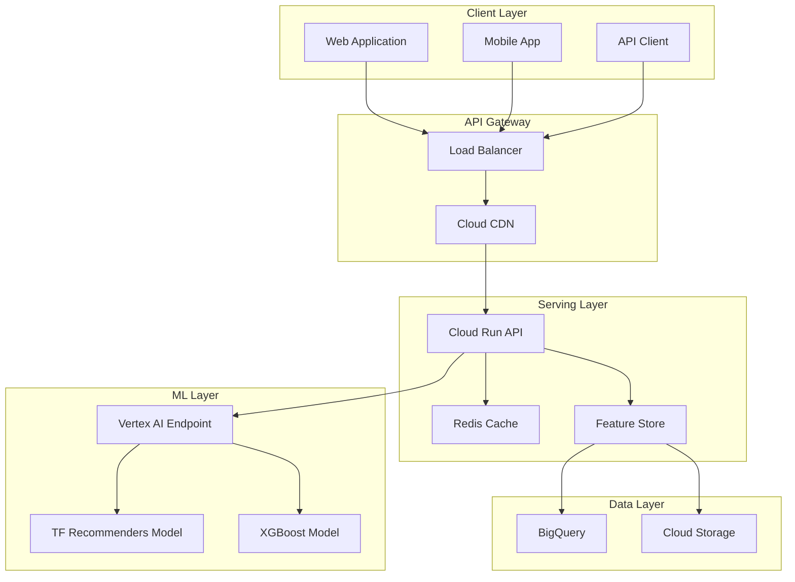

# VertexRec Serving Guide

## Overview

This guide provides comprehensive instructions for deploying and using the VertexRec recommendation API service. The serving layer consists of a FastAPI-based Cloud Run service that integrates with Vertex AI Endpoints for model inference.

## Architecture

### Serving Components



## API Endpoints

### Base URL

```
https://vertexrec-api-[hash]-uc.a.run.app
```

### Authentication

The API supports multiple authentication methods:

- **API Key**: Include in request headers
- **OAuth 2.0**: Bearer token authentication
- **Service Account**: For server-to-server communication

### Endpoints

#### 1. Health Check

**GET** `/health`

Check service health and dependencies.

**Response**:

```json
{
  "status": "healthy",
  "timestamp": "2024-01-15T10:30:00Z",
  "version": "1.0.0",
  "dependencies": {
    "vertex_ai": "ok",
    "bigquery": "ok",
    "storage": "ok"
  }
}
```

#### 2. Get Recommendations

**POST** `/recommend`

Get personalized recommendations for a user.

**Request**:

```json
{
  "user_id": "user_12345",
  "k": 10,
  "context": {
    "time_of_day": "evening",
    "device": "mobile",
    "location": "US"
  }
}
```

**Response**:

```json
{
  "user_id": "user_12345",
  "recommendations": [
    {
      "item_id": "item_67890",
      "score": 0.95,
      "title": "The Great Adventure",
      "genre": "Adventure",
      "rating_avg": 4.5,
      "price": 9.99
    }
  ],
  "model_version": "1.0.0",
  "timestamp": "2024-01-15T10:30:00Z",
  "processing_time_ms": 85.2
}
```

#### 3. Get Similar Items

**POST** `/similar`

Find items similar to a given item.

**Request**:

```json
{
  "item_id": "item_67890",
  "k": 5
}
```

**Response**:

```json
{
  "item_id": "item_67890",
  "similar_items": [
    {
      "item_id": "item_12345",
      "similarity_score": 0.89,
      "title": "Epic Journey",
      "genre": "Adventure",
      "rating_avg": 4.3,
      "price": 8.99
    }
  ],
  "model_version": "1.0.0",
  "timestamp": "2024-01-15T10:30:00Z",
  "processing_time_ms": 45.1
}
```

#### 4. Get User History

**GET** `/users/{user_id}/history`

Get user interaction history.

**Response**:

```json
{
  "user_id": "user_12345",
  "history": [
    {
      "item_id": "item_11111",
      "rating": 4.5,
      "timestamp": "2024-01-14T20:15:00Z",
      "interaction_type": "watch"
    }
  ]
}
```

#### 5. Get Item Details

**GET** `/items/{item_id}/details`

Get detailed information about an item.

**Response**:

```json
{
  "item_id": "item_67890",
  "title": "The Great Adventure",
  "genre": "Adventure",
  "release_date": "2023-06-15",
  "popularity_score": 0.85,
  "quality_score": 0.92,
  "price": 9.99,
  "duration_minutes": 120,
  "language": "English",
  "rating_avg": 4.5,
  "rating_count": 1250
}
```

## Usage Examples

### Python Client

```python
import requests
import json

# API configuration
API_BASE_URL = "https://vertexrec-api-[hash]-uc.a.run.app"
API_KEY = "your-api-key"

headers = {
    "Authorization": f"Bearer {API_KEY}",
    "Content-Type": "application/json"
}

# Get recommendations
def get_recommendations(user_id: str, k: int = 10):
    url = f"{API_BASE_URL}/recommend"
    payload = {
        "user_id": user_id,
        "k": k,
        "context": {
            "time_of_day": "evening",
            "device": "mobile"
        }
    }

    response = requests.post(url, json=payload, headers=headers)
    response.raise_for_status()
    return response.json()

# Get similar items
def get_similar_items(item_id: str, k: int = 5):
    url = f"{API_BASE_URL}/similar"
    payload = {
        "item_id": item_id,
        "k": k
    }

    response = requests.post(url, json=payload, headers=headers)
    response.raise_for_status()
    return response.json()

# Example usage
recommendations = get_recommendations("user_12345", k=10)
print(f"Found {len(recommendations['recommendations'])} recommendations")

similar_items = get_similar_items("item_67890", k=5)
print(f"Found {len(similar_items['similar_items'])} similar items")
```

### JavaScript Client

```javascript
// API configuration
const API_BASE_URL = "https://vertexrec-api-[hash]-uc.a.run.app";
const API_KEY = "your-api-key";

const headers = {
  Authorization: `Bearer ${API_KEY}`,
  "Content-Type": "application/json",
};

// Get recommendations
async function getRecommendations(userId, k = 10) {
  const url = `${API_BASE_URL}/recommend`;
  const payload = {
    user_id: userId,
    k: k,
    context: {
      time_of_day: "evening",
      device: "mobile",
    },
  };

  const response = await fetch(url, {
    method: "POST",
    headers: headers,
    body: JSON.stringify(payload),
  });

  if (!response.ok) {
    throw new Error(`HTTP error! status: ${response.status}`);
  }

  return await response.json();
}

// Get similar items
async function getSimilarItems(itemId, k = 5) {
  const url = `${API_BASE_URL}/similar`;
  const payload = {
    item_id: itemId,
    k: k,
  };

  const response = await fetch(url, {
    method: "POST",
    headers: headers,
    body: JSON.stringify(payload),
  });

  if (!response.ok) {
    throw new Error(`HTTP error! status: ${response.status}`);
  }

  return await response.json();
}

// Example usage
getRecommendations("user_12345", 10)
  .then((recommendations) => {
    console.log(
      `Found ${recommendations.recommendations.length} recommendations`
    );
  })
  .catch((error) => {
    console.error("Error:", error);
  });
```

### cURL Examples

```bash
# Health check
curl -X GET "https://vertexrec-api-[hash]-uc.a.run.app/health"

# Get recommendations
curl -X POST "https://vertexrec-api-[hash]-uc.a.run.app/recommend" \
  -H "Authorization: Bearer your-api-key" \
  -H "Content-Type: application/json" \
  -d '{
    "user_id": "user_12345",
    "k": 10,
    "context": {
      "time_of_day": "evening",
      "device": "mobile"
    }
  }'

# Get similar items
curl -X POST "https://vertexrec-api-[hash]-uc.a.run.app/similar" \
  -H "Authorization: Bearer your-api-key" \
  -H "Content-Type: application/json" \
  -d '{
    "item_id": "item_67890",
    "k": 5
  }'
```

## Performance Optimization

### Caching Strategy

The API implements multi-layer caching:

1. **Response Caching**: Cache API responses for frequently requested data
2. **Feature Caching**: Cache user and item features in memory
3. **Model Caching**: Cache model predictions for similar requests
4. **CDN Caching**: Cache static responses at the edge

### Rate Limiting

The API implements rate limiting to ensure fair usage:

- **Per-user limits**: 100 requests per minute per user
- **Per-IP limits**: 1000 requests per minute per IP
- **Burst allowance**: Allow short bursts above limits
- **Graceful degradation**: Return cached results when limits exceeded

### Load Balancing

- **Automatic scaling**: Scale based on traffic
- **Health checks**: Route traffic only to healthy instances
- **Geographic distribution**: Deploy in multiple regions
- **Traffic splitting**: A/B testing and canary deployments

## Monitoring and Observability

### Metrics

The API tracks comprehensive metrics:

- **Request metrics**: Latency, throughput, error rates
- **Business metrics**: Recommendation click-through rates
- **System metrics**: CPU, memory, network usage
- **Custom metrics**: Model performance, feature freshness

### Logging

Structured logging provides detailed observability:

```json
{
  "timestamp": "2024-01-15T10:30:00Z",
  "level": "INFO",
  "message": "Recommendation request processed",
  "user_id": "user_12345",
  "k": 10,
  "processing_time_ms": 85.2,
  "model_version": "1.0.0",
  "recommendations_count": 10
}
```

### Alerting

Automated alerting for critical issues:

- **High error rates**: > 5% error rate
- **High latency**: > 500ms p95 latency
- **Low throughput**: < 100 requests/second
- **Model drift**: Significant prediction changes

## Error Handling

### Error Codes

| Code | Description           | Action               |
| ---- | --------------------- | -------------------- |
| 400  | Bad Request           | Check request format |
| 401  | Unauthorized          | Check API key        |
| 403  | Forbidden             | Check permissions    |
| 404  | Not Found             | Check resource ID    |
| 429  | Too Many Requests     | Implement backoff    |
| 500  | Internal Server Error | Retry request        |
| 503  | Service Unavailable   | Check service status |

### Error Response Format

```json
{
  "error": {
    "code": "INVALID_USER_ID",
    "message": "User ID not found",
    "details": {
      "user_id": "invalid_user",
      "timestamp": "2024-01-15T10:30:00Z"
    }
  }
}
```

### Retry Strategy

Implement exponential backoff for retries:

```python
import time
import random

def retry_with_backoff(func, max_retries=3, base_delay=1):
    for attempt in range(max_retries):
        try:
            return func()
        except requests.exceptions.RequestException as e:
            if attempt == max_retries - 1:
                raise e

            delay = base_delay * (2 ** attempt) + random.uniform(0, 1)
            time.sleep(delay)
```

## Security Considerations

### Authentication

- **API Keys**: Secure key management and rotation
- **OAuth 2.0**: Industry-standard authentication
- **Service Accounts**: Secure server-to-server communication
- **JWT Tokens**: Stateless authentication

### Authorization

- **Role-based access**: Different permissions for different users
- **Resource-level permissions**: Control access to specific resources
- **Rate limiting**: Prevent abuse and ensure fair usage
- **Audit logging**: Track all access and modifications

### Data Protection

- **Encryption**: Encrypt data in transit and at rest
- **PII protection**: Mask or anonymize personal information
- **GDPR compliance**: Right to be forgotten, data portability
- **Data retention**: Automatic data cleanup policies

## Deployment

### Environment Configuration

```bash
# Required environment variables
PROJECT_ID=your-gcp-project-id
REGION=us-central1
DATASET_ID=vertexrec_dataset
ENDPOINT_NAME=vertexrec-endpoint
FEATURE_STORE_ID=vertexrec-feature-store

# Optional configuration
API_KEY=your-secret-api-key
CORS_ORIGINS=http://localhost:3000,https://your-domain.com
LOG_LEVEL=INFO
ENABLE_METRICS=true
```

### Deployment Commands

```bash
# Build and deploy
make build-image
make push-image
make deploy-api

# Or use the deployment script
python scripts/deploy_cloud_run.py \
  --project-id your-gcp-project-id \
  --region us-central1 \
  --service-name vertexrec-api
```

### Health Checks

```bash
# Check service health
curl https://vertexrec-api-[hash]-uc.a.run.app/health

# Check specific endpoint
curl -X POST https://vertexrec-api-[hash]-uc.a.run.app/recommend \
  -H "Content-Type: application/json" \
  -d '{"user_id": "test_user", "k": 1}'
```

## Best Practices

### API Usage

1. **Implement caching**: Cache responses to reduce API calls
2. **Use pagination**: For large result sets
3. **Handle errors gracefully**: Implement proper error handling
4. **Monitor usage**: Track API usage and costs
5. **Update regularly**: Keep client libraries updated

### Performance

1. **Batch requests**: Combine multiple requests when possible
2. **Use compression**: Enable gzip compression
3. **Optimize payloads**: Send only necessary data
4. **Implement timeouts**: Set appropriate timeout values
5. **Monitor latency**: Track and optimize response times

### Security

1. **Secure API keys**: Store keys securely
2. **Use HTTPS**: Always use encrypted connections
3. **Validate input**: Sanitize all user input
4. **Implement rate limiting**: Prevent abuse
5. **Monitor access**: Track and audit API usage

## Troubleshooting

### Common Issues

1. **High latency**: Check model performance and caching
2. **Authentication errors**: Verify API keys and permissions
3. **Rate limit exceeded**: Implement backoff and caching
4. **Model errors**: Check model deployment and health
5. **Feature errors**: Verify feature store connectivity

### Debugging

1. **Enable debug logging**: Set LOG_LEVEL=DEBUG
2. **Check service logs**: Use Cloud Logging
3. **Monitor metrics**: Use Cloud Monitoring
4. **Test endpoints**: Use health check endpoints
5. **Verify configuration**: Check environment variables

### Support

For technical support:

- **Documentation**: Check this guide and API docs
- **Logs**: Review service logs in Cloud Logging
- **Metrics**: Monitor performance in Cloud Monitoring
- **Issues**: Report bugs via GitHub issues
- **Community**: Join the discussion forum

## Conclusion

The VertexRec serving layer provides a robust, scalable, and secure API for recommendation services. By following this guide, you can effectively integrate with the API and build applications that leverage the power of machine learning recommendations.

Key benefits:

- **High performance**: Sub-100ms response times
- **Scalability**: Automatic scaling based on demand
- **Reliability**: 99.9% uptime with fault tolerance
- **Security**: Enterprise-grade security and compliance
- **Monitoring**: Comprehensive observability and alerting

The API is designed to be developer-friendly while providing enterprise-grade performance and reliability for production use cases.
